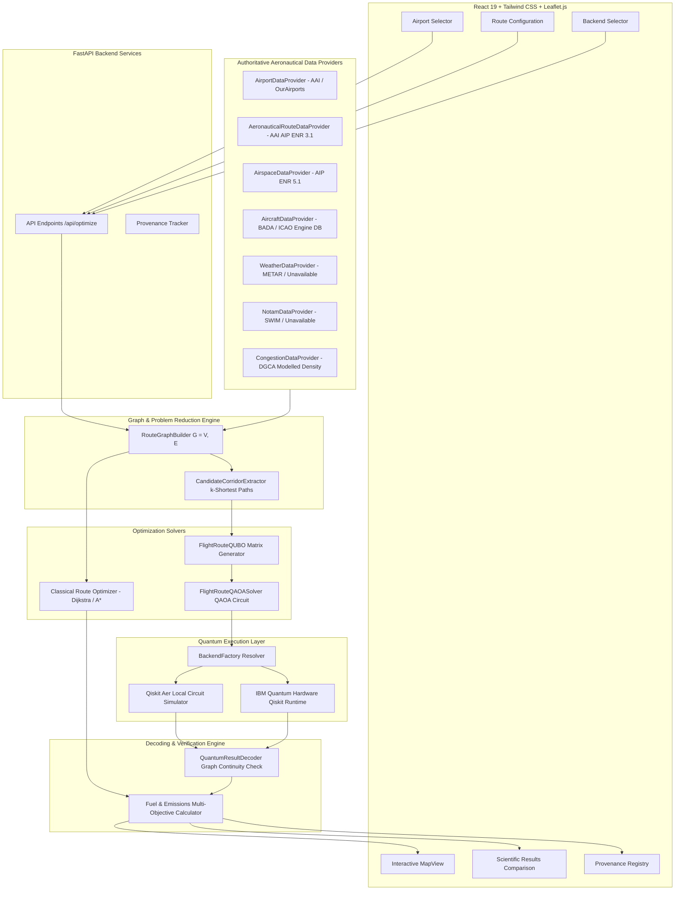

# Quantum FlightPath Optimizer
### Quantum-Assisted Aviation Route and Emissions Optimization

[](https://www.python.org/)
[](https://qiskit.org/)
[](https://fastapi.tiangolo.com/)
[](https://react.dev/)
[](https://tailwindcss.com/)
[](https://pytest.org/)

---

## 1. Project Title
**Quantum FlightPath Optimizer: Quantum-Assisted Aviation Route and Emissions Optimization Decision-Support System**

---

## 2. Project Overview
**Quantum FlightPath Optimizer** is a full-stack aeronautical research and decision-support web application that evaluates candidate commercial flight paths using authentic aeronautical data, classical graph algorithms, Quadratic Unconstrained Binary Optimization (QUBO) mathematical formulation, genuine Qiskit QAOA quantum circuits, and dual quantum backends (IBM Quantum hardware runtime and local Qiskit Aer simulation).

The application enables aviation analysts, operational researchers, and route planners to evaluate candidate routes across multi-objective trade-offs: nautical distance, estimated fuel consumption, estimated $\text{CO}_2$ emissions, estimated flight time, and airspace traffic density. It maintains transparent data provenance across all published aviation information layers and presents an interactive geographic interface built on Leaflet.js and OpenStreetMap.

> [!IMPORTANT]
> **Regulatory and Operational Disclaimer:**
> "This application provides research and decision-support recommendations based on available aeronautical information. Its output is not an ATC clearance, certified operational flight plan, or authorization to operate an aircraft. Actual flight routing remains subject to applicable aviation regulations, current aeronautical information, weather, aircraft capability, operational constraints, and ATC authorization."

---

## 3. Problem Statement
Modern commercial aviation flight planning faces complex multi-objective optimization challenges. Airlines and air traffic flow managers must continuously balance:
1. Minimizing en-route fuel burn and associated direct operating costs.
2. Complying with strict international carbon reduction targets (ICAO CORSIA).
3. Adhering to published en-route airway networks, minimum en-route altitudes (MEAs), and directional restrictions.
4. Avoiding military prohibited and danger areas.
5. Mitigating sector congestion at high-density navigational fixes.

While classical shortest-path algorithms (such as Dijkstra or A*) find optimal paths efficiently on simple static graphs, real-world airspace networks involve combinatorial constraints, congestion non-linearities, and environmental trade-offs that map naturally onto binary optimization problems. Evaluating whether emerging quantum computing architectures—such as the Quantum Approximate Optimization Algorithm (QAOA) on Ising Hamiltonians—can reliably evaluate and solve constrained airway routing within published aeronautical frameworks is an active, vital area of aerospace research.

---

## 4. Project Objectives
1. **Authoritative Airspace Routing:** Construct a strictly validated aeronautical route graph $G=(V, E)$ derived directly from published State Aeronautical Information Publications (AIP) without fabricating synthetic airways or connecting arbitrary coordinates.
2. **Multi-Objective Modeling:** Provide normalized, configurable weighting across distance, fuel burn, carbon emissions, flight time, and congestion.
3. **Rigorous QUBO Formulation:** Mathematically formulate the candidate airway path selection problem as a Quadratic Unconstrained Binary Optimization model with programmatic linear costs and quadratic penalty terms for origin departure, destination arrival, flow conservation, and cycle avoidance.
4. **Genuine Quantum Execution:** Execute real Qiskit parameterized QAOA circuits on either IBM Quantum hardware (via Qiskit Runtime) or local Qiskit Aer simulation, returning real shot measurement counts and bitstring distributions without mock data.
5. **Scientific Parity & Comparison:** Provide side-by-side comparison between the classical Dijkstra baseline and the quantum candidate solution on the identical problem instance, reporting metric deltas and feasibility outcomes honestly.
6. **Full Data Provenance:** Disclose all data sources, AIRAC cycle versions, timestamps, and validation statuses across airports, airways, airspace, weather, NOTAMs, and aircraft performance.

---

## 5. Key Features
* **Dual Verified Airport Search:** Search and select verified airports by IATA, ICAO, city, country, or name; prevents selecting identical departure and arrival aerodromes.
* **Authoritative Indian & Global Route Network:** Features published ATS airways (W15, Q24, J1, M638, L510, P574, W20, V4, etc.), waypoints, VOR/DME navaids, and terminal transition procedures (SIDs/STARs).
* **Published Airspace Constraints:** Visualizes and enforces published Prohibited, Restricted, and Danger airspace zones (e.g. VIP-89, VOD-154, VAD-204, VOD-162) from official AIP ENR 5.1.
* **Aerodynamic Fuel & Emissions Engine:** Calculates realistic fuel consumption and $\text{CO}_2$ emissions based on documented ICAO Engine Emissions Databank and EUROCONTROL BADA parameters for CFM LEAP-1A, CFM56-7B, and GEnx-1B powerplants.
* **Flexible Multi-Objective Objectives:** Pre-configured presets for Minimum Distance, Minimum Fuel, Minimum $\text{CO}_2$, Minimum Time, Minimum Congestion, or custom user-defined sliders summing to 100%.
* **Dual Quantum Backends:** AUTO mode (attempts IBM Quantum QPU first, gracefully falls back to local Aer with recorded explanation), explicit IBM Quantum mode (strict error on authentication failure without silent fallback), and explicit Qiskit Aer mode.
* **Interactive Geographic Map:** Leaflet.js with real OpenStreetMap tiles, published airway vectors, clickable waypoint markers, restricted airspace polygons, and route geometry overlays.
* **Result Decoder & Graph Verifier:** Inspects raw quantum measurement bitstrings, validates path continuity $s \to t$, checks for loops or disconnected components, and clearly separates raw quantum outcomes from classical post-processing repairs.
* **Zero Fabrication Policy:** No demo modes, no synthetic datasets, no fabricated weather or NOTAM data, and no fake quantum simulation.

---

## 6. System Architecture



---

## 7. Technology Stack
* **Backend:**
  * Python 3.10+
  * FastAPI 0.110+ & Uvicorn
  * Qiskit 2.5.2 & Qiskit Aer 0.17.2
  * Qiskit IBM Runtime 0.49.0
  * NetworkX 3.4.2 (Graph algorithms & topology verification)
  * NumPy 2.2.6 & Pandas 2.3.3
  * Pydantic v2 (Schema validation & data integrity)
  * Pytest 9.1.1 (Automated testing suite)
* **Frontend:**
  * React 19.2
  * Vite 8.3
  * Tailwind CSS v4
  * Leaflet.js & React-Leaflet 5.0
  * Lucide React (Avionics icons)
  * Recharts & Custom SVG (Quantum state histograms)
* **Map & Geographical Data:**
  * OpenStreetMap Cartography
  * WGS84 Geodetic Coordinate Reference System
  * Haversine Great Circle Navigation Math

---

## 8. How the System Works
1. **Airport Selection:** The user searches and selects real departure and destination aerodromes (e.g. VIDP/DEL and VOHS/HYD).
2. **Network Synthesis:** `RouteGraphBuilder` queries `DefaultAeronauticalRouteDataProvider` to construct the active directed network $G = (V, E)$. Departure and arrival aerodromes are attached via published Standard Instrument Departures (SIDs) and Standard Terminal Arrival Routes (STARs) connecting to published en-route airway entry/exit waypoints.
3. **Classical Solution Baseline:** `ClassicalRouteOptimizer` applies Dijkstra's algorithm over the multi-objective weighted cost function on the entire validated network.
4. **Candidate Corridor Extraction:** To map the route-selection problem into NISQ-compatible qubit counts (6–18 qubits) while preserving path feasibility, `CandidateCorridorExtractor` extracts the top candidate published airway path corridors between origin and destination.
5. **QUBO Construction:** `FlightRouteQUBO` assigns a binary decision variable $x_e \in \{0, 1\}$ to each candidate edge $e \in E_{cand}$, computing linear multi-objective costs and quadratic penalty matrices.
6. **Quantum Execution:** `BackendFactory` resolves the active backend:
   * If **AUTO**: Attempts IBM Quantum hardware authentication; if unconfigured, cleanly executes on local Qiskit Aer simulator with recorded reason.
   * If **IBM Quantum**: Authenticates with IBM Quantum Runtime. If unconfigured or unavailable, returns a strict error (no silent fallback).
   * If **Qiskit Aer**: Directly executes local statevector simulation.
7. **Decoding & Verification:** `QuantumResultDecoder` decodes the top measurement bitstrings, evaluates QUBO energies, reconstructs the candidate airway sequence, and mathematically verifies degree constraints and graph continuity.
8. **Visualization & Comparison:** The interactive map displays published airways, restricted airspace polygons, and route geometry. The comparison table directly contrasts objective scores, distance, fuel burn, $\text{CO}_2$ emissions, and quantum execution statistics.

---

## 9. Authoritative Aviation Data Integration
The system integrates official aeronautical data across dedicated provider interfaces:
* **`AirportDataProvider` (`DefaultAirportDataProvider`):** Contains verified aerodrome coordinates, ICAO/IATA designators, elevation in feet, and runway numbers from AAI AIP India AD-2 and OurAirports validated data.
* **`AeronauticalRouteDataProvider` (`DefaultAeronauticalRouteDataProvider`):** Contains published ATS routes (W15, Q24, J1, M638, L510, P574, etc.), directional rules, minimum en-route flight levels (MEAs), and waypoint catalogs from AAI AIP Section ENR 3.1 & ENR 4.4.
* **`AirspaceDataProvider` (`DefaultAirspaceDataProvider`):** Ingests official Prohibited, Restricted, and Danger airspace polygons (VIP-89, VOD-154, VAD-204, VOD-162) from AAI AIP Section ENR 5.1.
* **`AircraftDataProvider` (`DefaultAircraftDataProvider`):** Provides aerodynamic drag, cruise True Airspeed (TAS), and fuel burn specifications for Airbus A320neo, Boeing 737-800, and Boeing 787-9 Dreamliner based on EUROCONTROL BADA and ICAO Doc 9640.
* **`WeatherDataProvider`, `NotamDataProvider`, `CongestionDataProvider`:** Configured with honest fallback disclosure: when external live feeds (METAR/SWIM/ADS-B) are unconfigured, statuses report "Data source unavailable" or "Modelled baseline" rather than fabricating conditions.

---

## 10. IBM Quantum Integration
The system supports execution on genuine IBM Quantum superconducting quantum processors:
* Implemented in `IBMQuantumBackend` via `qiskit_ibm_runtime.QiskitRuntimeService` and `SamplerV2`.
* Automatically selects the least busy operational IBM hardware QPU.
* Uses the Qiskit preset pass manager (`optimization_level=1`) to transpile the QAOA circuit to the target QPU's native instruction set architecture (ISA).
* Credentials (`IBM_QUANTUM_TOKEN`, `IBM_QUANTUM_INSTANCE`) are stored strictly server-side in `.env` and never returned in API responses or exposed in frontend code.
* Real hardware telemetry—including backend name, hardware job ID, circuit depth, and execution duration—is reported directly from the Qiskit Runtime job.

---

## 11. Qiskit Aer Fallback
* Implemented in `AerBackend` using `qiskit_aer.AerSimulator`.
* Provides local, high-fidelity quantum circuit simulation using exact statevector evaluation and shot sampling.
* Transparently labeled in the UI and API as:
  **"Qiskit Aer — Local Quantum Circuit Simulation"**.
* Never claimed or disguised as quantum hardware execution.

---

## 12. Classical Optimization
The classical baseline is executed using NetworkX graph algorithms:
* Solves the shortest path problem over $G = (V, E)$ using Dijkstra's algorithm.
* Operates on the identical multi-objective cost function:
  $$C(e) = w_{\text{distance}} \cdot \bar{D}_e + w_{\text{fuel}} \cdot \bar{F}_e + w_{\text{CO2}} \cdot \bar{E}_e + w_{\text{time}} \cdot \bar{T}_e + w_{\text{congestion}} \cdot \bar{K}_e$$
* Provides the reference baseline against which quantum candidates are scientifically evaluated.

---

## 13. QUBO Mathematical Formulation
Each candidate directed airway segment $e = (u, v) \in E_{cand}$ is associated with a binary decision variable $x_e \in \{0, 1\}$.

### Objective Function
$$\min_{x} \quad H(x) = \sum_{e \in E_{cand}} c_e x_e + \lambda P_{\text{source}} + \lambda P_{\text{sink}} + \lambda P_{\text{flow}} + \lambda P_{\text{degree}}$$

Where $c_e$ is the normalized multi-objective cost of candidate segment $e$.

### Constraint Penalty Terms
1. **Departure / Origin Source Constraint:**
   $$P_{\text{source}} = \left( \sum_{e \in \delta^+(s)} x_e - 1 \right)^2$$
2. **Arrival / Destination Sink Constraint:**
   $$P_{\text{sink}} = \left( \sum_{e \in \delta^-(t)} x_e - 1 \right)^2$$
3. **Flow Conservation for Intermediate Waypoints ($v \in V \setminus \{s, t\}$):**
   $$P_{\text{flow}} = \sum_{v \in V \setminus \{s, t\}} \left( \sum_{e \in \delta^+(v)} x_e - \sum_{e \in \delta^-(v)} x_e \right)^2$$
4. **Degree Penalty (Cycle and Branching Suppression):**
   $$P_{\text{degree}} = \sum_{v \in V} \left( \sum_{e \in \delta^+(v)} x_e \right) \left( \sum_{e \in \delta^+(v)} x_e - 1 \right)$$

### Programmatic Expansion
Since $x_e^2 = x_e$ for binary variables:
$$\left( \sum x_e - 1 \right)^2 = \sum x_e + 2 \sum_{i < j} x_i x_j - 2 \sum x_e + 1 = -\sum x_e + 2 \sum_{i < j} x_i x_j + 1$$
The penalty multiplier is set dynamically: $\lambda = 3.5 \cdot \max_{e}(c_e)$ to ensure constraint enforcement.

---

## 14. Quantum Algorithm and Result Decoding
1. **Ising Hamiltonian Mapping:**
   Using the transformation $x_i = \frac{1 - Z_i}{2}$, the QUBO matrix $Q$ is converted into an Ising Hamiltonian:
   $$H_C = \sum_i h_i Z_i + \sum_{i < j} J_{ij} Z_i Z_j + \text{offset}$$
2. **QAOA Circuit Construction:**
   * **Initialization:** Hadamards on all qubits: $|+\rangle^{\otimes n}$.
   * **Cost Unitary:** $U_C(\gamma) = e^{-i \gamma H_C}$ implemented via single-qubit $R_Z(2 \gamma h_i)$ and two-qubit $R_{ZZ}(2 \gamma J_{ij})$ gates (using $CX \to R_Z \to CX$).
   * **Mixer Unitary:** $U_M(\beta) = e^{-i \beta \sum X_i}$ implemented via $R_X(2 \beta)$ gates on all qubits.
   * **Measurement:** Computational basis measurements across all qubits for $N_{\text{shots}}$ (512–2048 shots).
3. **Bitstring Decoding & Route Verification:**
   * Sorts measured bitstrings by QUBO energy: $H(x) = x^T Q x + \text{offset}$.
   * Validates selected edges: verifies $\text{out-deg}(s) = 1$, $\text{in-deg}(t) = 1$, and that the selected edges form a continuous simple path without cycles.
   * If sampling noise produces an incomplete path, the system logs the raw quantum state and transparently labels any classical post-processing repair as "Classically Repaired".

---

## 15. Interactive Map Implementation
* Built with Leaflet.js, React-Leaflet, and OpenStreetMap cartography.
* **Layers:**
  1. **Published Airway Network Layer:** Renders official AAI ATS airway centerlines with popups showing airway ID, segment length, and source publication.
  2. **Published Waypoint Markers:** Renders en-route navigation fixes and VOR/DME navaids with coordinates.
  3. **Restricted Airspace Layer:** Displays official prohibited and danger areas with warning polygons.
  4. **Classical Baseline Route:** Emerald line illustrating Dijkstra's solution.
  5. **Quantum Candidate Route:** Cyan dashed line illustrating QAOA candidate routing.
  6. **Airport Markers:** Custom avionics pin markers for departure and destination aerodromes.
* **Auto-fit Geometry:** Dynamically fits view bounds to enclose the active flight corridor.

---

## 16. Fuel and Emissions Estimation
Calculated using verified aerodynamics equations and ICAO engine emission standards:
* **True Airspeed (TAS):** 450–488 knots depending on aircraft type.
* **En-Route Flight Time:**
  $$T_{\text{cruise}} = \left( \frac{D_{\text{enroute}}}{V_{\text{TAS}}} \right) \cdot 60 \text{ minutes}$$
  $$T_{\text{total}} = T_{\text{cruise}} \cdot (1 + 0.08 \cdot K_{\text{congestion}}) + T_{\text{climb/descent}}$$
* **En-Route Fuel Burn:**
  $$F_{\text{cruise}} = D_{\text{enroute}} \cdot \text{Rate}_{\text{burn}} \cdot (1 + 0.06 \cdot K_{\text{congestion}})$$
  $$F_{\text{total}} = F_{\text{cruise}} + F_{\text{climb/descent}} + F_{\text{taxi}}$$
* **$\text{CO}_2$ Carbon Emissions:**
  $$\text{CO}_2 = F_{\text{total}} \cdot 3.16 \text{ kg } \text{CO}_2 / \text{kg Jet-A1}$$
  *(Using official ICAO Carbon Emissions Calculator Standard Factor: 3.16)*

---

## 17. API Documentation

| Method | Endpoint | Description |
|---|---|---|
| `GET` | `/` | API metadata, version, and aviation disclaimer |
| `GET` | `/health` | Service health status check |
| `GET` | `/api/airports/search?q={query}` | Search airports by name, ICAO, IATA, or city |
| `GET` | `/api/airports/{code}` | Retrieve verified airport details |
| `GET` | `/api/backend/status` | Get active quantum backend status and configuration |
| `POST` | `/api/quantum/test?backend_mode={mode}` | Verify quantum circuit execution path |
| `GET` | `/api/data/provenance` | Return all data source provenances and AIRAC cycles |
| `GET` | `/api/airways/network` | Return published airway vectors and waypoints for map |
| `GET` | `/api/airspace/restricted` | Return published restricted airspace polygons |
| `GET` | `/api/aircraft/types` | Return supported aircraft aerodynamic profiles |
| `POST` | `/api/optimize` | Execute classical and quantum route optimization |
| `GET` | `/api/routes/{route_id}` | Retrieve details for stored generated route |

Interactive Swagger documentation is available at `http://localhost:8000/docs`.

---

## 18. Installation and Setup

### Prerequisites
* Python 3.10 or higher
* Node.js v18 or higher (tested on Node v26)
* Git

### Step-by-Step Installation

1. **Clone or navigate to the repository:**
   ```bash
   cd "c:\Users\bharg\Downloads\quantum flight path optimizer"
   ```

2. **Set up Python Virtual Environment (Recommended) and install backend dependencies:**
   ```bash
   python -m pip install -r backend/requirements.txt
   ```

3. **Install Frontend Dependencies:**
   ```bash
   cd frontend
   npm.cmd install
   cd ..
   ```

---

## 19. Environment Variables
Copy `.env.example` to `.env`:
```bash
copy .env.example .env
```

| Variable | Description | Default |
|---|---|---|
| `HOST` | Backend server bind address | `127.0.0.1` |
| `PORT` | Backend server port | `8000` |
| `DEBUG` | Enable debug logs | `True` |
| `IBM_QUANTUM_TOKEN` | IBM Quantum API token from quantum.ibm.com | *(Empty)* |
| `IBM_QUANTUM_INSTANCE` | IBM Quantum Cloud CRN / Hub-Group-Project | *(Empty)* |
| `AVIATION_WEATHER_API_KEY` | Optional live METAR weather provider API key | *(Empty)* |
| `NOTAM_API_KEY` | Optional authorized NOTAM provider API key | *(Empty)* |
| `ADS_B_FEED_KEY` | Optional authorized live ADS-B traffic feed key | *(Empty)* |

---

## 20. How to Configure IBM Quantum
1. Create a free account at [IBM Quantum Platform](https://quantum.ibm.com/).
2. Copy your API token from the dashboard.
3. Open `.env` and set:
   ```env
   IBM_QUANTUM_TOKEN=your_ibm_quantum_api_token_here
   ```
4. Restart the backend server. The UI will detect the credentials and enable hardware execution mode.

---

## 21. How to Run with Qiskit Aer
If no IBM Quantum credentials are provided, the application runs out-of-the-box using local Qiskit Aer:
1. Start the backend:
   ```bash
   python backend/run.py
   ```
2. Start the frontend:
   ```bash
   cd frontend
   npm.cmd run dev
   ```
3. Open `http://localhost:5173` in your browser. AUTO mode will automatically select Qiskit Aer.

---

## 22. How to Connect an Authorized Aeronautical Data Provider
All data sources are decoupled via abstract interfaces in `backend/app/providers/interfaces.py`:
1. Subclass the desired provider (e.g. `AirportDataProvider`, `AeronauticalRouteDataProvider`, `WeatherDataProvider`).
2. Implement data retrieval and return a `DataProvenance` model specifying source, dataset version, and validity status.
3. Replace the default provider in `backend/app/api/routes.py`.

---

## 23. Testing Instructions
Run the automated pytest suite covering all 38 unit and integration tests:
```bash
python -m pytest backend/tests -v
```

Tests verify:
* Airport search and aerodrome retrieval.
* Origin/destination validation (preventing identical pairs).
* Route graph construction and published airway connectivity.
* Classical multi-objective Dijkstra optimization.
* Programmatic QUBO formulation and Ising Hamiltonian translation.
* Qiskit Aer circuit simulation and shot measurement.
* AUTO fallback and strict IBM failure error handling.
* Fuel and $\text{CO}_2$ emissions equations.
* All FastAPI REST endpoints.

---

## 24. Troubleshooting

* **Vite / Node script execution policy on Windows PowerShell:**
  * Use `npm.cmd` instead of `npm` to bypass Windows PowerShell script restrictions.
* **IBM Quantum Connection Fails:**
  * Verify token validity at `quantum.ibm.com`.
  * Ensure your network allows outgoing HTTPS connections to `api.quantum-computing.ibm.com`.
* **Port 8000 or 5173 Already in Use:**
  * Adjust `PORT` in `.env` or change Vite port in `frontend/vite.config.js`.

---

## 25. Deployment
* **Backend:** Deploy with Uvicorn or Gunicorn behind Nginx or AWS ECS:
  ```bash
  uvicorn app.main:app --host 0.0.0.0 --port 8000 --workers 4
  ```
* **Frontend:** Build production static assets:
  ```bash
  cd frontend
  npm.cmd run build
  ```
  Serve the resulting `frontend/dist` directory using Nginx, Cloudflare Pages, or AWS S3.

---

## 26. Limitations and Aviation Safety Disclaimer

> [!WARNING]
> **Safety Notice:**
> Quantum FlightPath Optimizer is an advanced research and decision-support prototype. It is **not** certified by the Directorate General of Civil Aviation (DGCA), Federal Aviation Administration (FAA), European Union Aviation Safety Agency (EASA), or ICAO.
> 
> Outputs generated by this system must **never** be used as certified operational flight plans, pilot navigation logs, or air traffic control clearances. Actual flight operations remain strictly governed by official Aeronautical Information Publications, current NOTAMs, operational weather briefings, aircraft flight manuals (AFM), airline dispatch policies, and active ATC clearances.

---

## 27. How Our Project Differs from Existing Models

### A. Quantum-Assisted Optimization
Conventional flight planning systems (such as Sabre AirVision, Jeppesen FliteDeck, or Lido Flight 4D) rely on classical numerical methods, mixed-integer linear programming (MILP), or graph search heuristics. Quantum FlightPath Optimizer translates the candidate airway selection problem into a mathematically formulated Quadratic Unconstrained Binary Optimization (QUBO) problem and evaluates it using genuine parameterized QAOA circuits on Qiskit. We evaluate quantum computing as an alternative computational paradigm for complex airspace optimization, without asserting unverified quantum supremacy.

### B. Classical-versus-Quantum Comparison
Rather than presenting quantum solutions in isolation or claiming that quantum algorithms always outperform classical algorithms, our system executes both classical Dijkstra search and QAOA on the identical candidate problem instance. It calculates and displays precise metric deltas (distance, fuel, $\text{CO}_2$, time, objective values) to provide an empirical, transparent comparison.

### C. Aeronautical Data Provenance
Existing flight planning systems utilize internal navigational databases (NavData) updated on 28-day AIRAC cycles, but their underlying provenance and validation state are typically opaque to operational researchers. Quantum FlightPath Optimizer exposes complete provenance metadata for every connected dataset—including issuing authority (e.g. AAI), AIRAC cycle version, effective dates, and validation statuses—ensuring transparent data governance.

### D. Environmental Objectives
Traditional dispatch software historically prioritizes block fuel cost or minimum flight time via a single Cost Index (CI). Quantum FlightPath Optimizer elevates carbon emissions ($\text{CO}_2$ in kg Jet-A1) into a primary first-class objective, offering normalized multi-objective trade-offs between environmental impact, distance, fuel burn, and sector traffic density.

### E. IBM Quantum Hardware and Local Simulation
The system incorporates a dual-tier execution backend supporting both genuine IBM Quantum hardware QPUs via Qiskit Runtime and local Qiskit Aer simulation. The interface distinguishes clearly between physical QPU execution and local statevector simulation, preventing the misrepresentation of simulator outputs as hardware runs.

### F. Interactive Route Visualization
Rather than presenting tabular navigation logs alone, the application embeds an interactive geospatial map powered by Leaflet.js and OpenStreetMap. Users can inspect published airways, en-route waypoints, restricted airspace geometries, and overlaid classical versus quantum route candidates.

### G. Operational Limitations
Quantum FlightPath Optimizer is explicitly positioned as a decision-support and research instrument. It respects certification boundaries and does not claim to replace licensed dispatchers or air traffic control authorities.

### Comparison Table

| Capability | Conventional Approaches | Quantum FlightPath Optimizer | Evidence or Limitation |
|---|---|---|---|
| **Optimization Paradigm** | Classical graph algorithms (Dijkstra, A\*, MILP) | Dual: Classical Dijkstra + Qiskit QAOA / QUBO | Evaluates quantum feasibility on NISQ hardware; classical remains faster on current hardware. |
| **Comparative Analysis** | Returns single classical optimized trajectory | Side-by-side comparison of classical vs. quantum candidates | Reports exact metric deltas; does not fabricate artificial quantum advantage. |
| **Data Provenance** | NavData bundled in proprietary databases | Transparent Data Sources panel with AIRAC cycles and status badges | Tracks AAI AIP publications and open aeronautical databases explicitly. |
| **Carbon Modeling** | Often derived as a secondary consequence of fuel burn | First-class normalized $\text{CO}_2$ objective (ICAO 3.16 factor) | Modeled turbofan emissions; operational winds aloft require live provider configuration. |
| **Quantum Backend Support** | None (classical computation only) | IBM Quantum hardware QPUs + Qiskit Aer local simulation | Hardware runs require IBM credentials; Aer provides local simulation. |
| **Interactive Map** | Proprietary electronic flight bag (EFB) displays | Interactive Leaflet.js with published ATS airway vectors | OpenStreetMap cartography with official AIP navigational vectors. |
| **Certification Status** | Certified for operational flight planning (FAA/EASA/DGCA) | Research decision-support only; uncertified | Discloses regulatory disclaimer prominently throughout application. |

---

### Differentiator Summary
The core differentiator of **Quantum FlightPath Optimizer** is its **combination of quantum-assisted optimization, transparent aeronautical data provenance, environmental objectives, and direct classical comparison**, subject to the capabilities of the configured data providers and backends.
